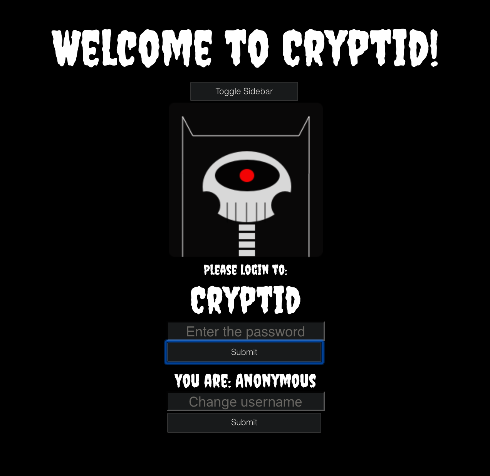
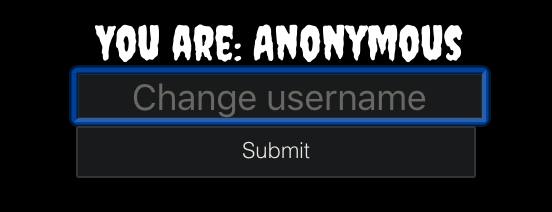
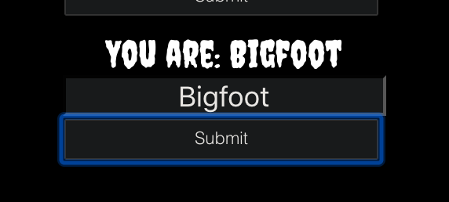

CRYPTID CHAT- ANONYMOUS CHAT MESSAGING APP!!!

## WHAT IT IS 

cryptid noun
cryp·​tid | \ ˈkrip-təd\
Definition of cryptid
: an animal (such as Sasquatch or the Loch Ness Monster) that has been claimed to exist but never proven to exist.

This is a final project, messaging app that allows users to create a chatroom with a password(hashed by bcrypt), and can input any username they want or choose to be anonymous. No login or information is required. The user can then share the chatroom password to friends or others they want to talk to. All chatrooms are not saved, and no information is shared. 

We used socket.io to build the main user functions of this project, and do not store any chat info. Our goal was to make users feel safe within a chat, and to make the user or the content of a chat anonymous or like it never exsisted. 

## WHAT WE USED 

Our team used React, Express, bcrypt, PostgresSQL, Node.js, and Styled Components.

## CHALLENGES AND SOLUTIONS

Challenge 1

As we discussed the project in the beginning and were inspired by new technologies avaiable to us,we first started the project in NEXT.js. After working with it for a few days we had problems with some of it's features and working with our global state in the framework. We also were having issues rendering our css and styled components due to the static html. We soon realized we bit off more than we could chew and had to backtrack to refactor our project in create-react-app. We quickly refactored, although it did put us back a few days. 

Challenge 2

After refactoring our app we dove into more user features such as adding multipule channels, password protected chats (bcrypt), and adding an input for a username or alias. 
We ran into an issue adding the channels feature,which was eventually solved by debugging and seeing a bug in the global state. YAY debugging!

## Authors 

Aaron Smith, Paxton Lindsey, and Brooke Colosi 

## SCREENSHOTS

users can log into a chat using a password created with the channel.

if user inserts the wrong password, it will notifiy you our icon turning into a skull cyclops!

users can choose to stay anonymous or choose a temporary username for their session.

## CODE

Our reducer:
  
  import React from "react";
import io from "socket.io-client";
export const CTX = React.createContext();

const initState = {
  selectedChannel: null,
  isVerified: false,
  socket: io(":3001"),
  user: "Anonymous",
  allChats: null,
  showError: false,
  sideBarToggle: true,
};
const reducer = (state, action) => {
  switch (action.type) {
    case "SET_CHANNEL_NAME":
      const newChannelName = action.payload;
      return {
        ...state,
        allChats: {
          ...state.allChats,
          [newChannelName]: [
            { from: "ChatBot", msg: "Welcome to a new chatroom!" },
          ],
        },
      };
    case "CREATE_CHANNEL":
      return {
        ...state,
        allChats: {
          ...state.allChats,
          newChannel: [
            { from: "chatbot", msg: "Welcome to a new chatroom! Type away!" },
          ],
        },
      };
    case "SET_USER_NAME":
      const newUserName = action.payload;
      return {
        ...state,
        user: [newUserName],
      };
    case "SET_SELECTED_CHANNEL":
      return {
        ...state,
        selectedChannel: action.payload,
        isVerified: false,
      };

    case "SET_USER_VALID":
      return {
        ...state,
        isVerified: true,
      };
    case "SET_ERROR":
      return {
        ...state,
        showError: true,
      };
    case "RESET_ERROR":
      return {
        ...state,
        showError: false,
      };
    case "SET_SIDEBAR_TOGGLE_T":
      return {
        ...state,
        sideBarToggle: true,
      };
    case "SET_SIDEBAR_TOGGLE_F":
      return {
        ...state,
        sideBarToggle: false,
      };
    case "RECEIVE_MESSAGE":
      const { from, msg, channel } = action.payload;
      return {
        ...state,
        allChats: {
          ...state.allChats,
          [channel]: [...state.allChats[state.selectedChannel], { from, msg }],
        },
      };
    case "RECEIVE_CHANNELS":
      const channels = action.payload;
      const newObj = {};
      channels.forEach((channel) => {
        newObj[channel.channel] = [
          { from: "chatbot", msg: "Welcome to a new chatroom! Type away!" },
        ];
      });
      return {
        ...state,
        allChats: newObj,
        selectedChannel: channels[0].channel,
      };
    default:
      return state;
  }
};

export const Store = (props) => {
  const [state, dispatch] = React.useReducer(reducer, initState);

  const myDispatch = (type, payload) => {
    dispatch({ type, payload });
  };

  return (
    <CTX.Provider value={{ state, dispatch: myDispatch }}>
      {props.children}
    </CTX.Provider>
  );
};

Our ChatBox: 

import React from "react";
import styled from "styled-components";
import Channels from "../Channels";
import UserMessage from "../UserMessage";
import monster from "../monster3.png";
import skel from "../skel.png";

import { CTX } from "../Store";

const ChatBox = () => {
  const [textValue, changeTextValue] = React.useState("");
  const [passwordValue, setPasswordValue] = React.useState("");
  const { state, dispatch } = React.useContext(CTX);
  React.useEffect(() => {
    state.socket.on("message", function (msg) {
      console.log("chat message recieved");
      dispatch("RECEIVE_MESSAGE", msg);
    });
  }, []);

  let newUserName = "";
  const userNameChanger = (e) => {
    newUserName = e.target.value;
    console.log(newUserName);
  };
  const usernameCreator = (newUserName) => {
    dispatch("SET_USER_NAME", newUserName);
  };

  const submitPasswordHandler = async () => {
    console.log("SELECTED CHANNEL", state.selectedChannel);
    const requestOptions = {
      method: "POST",
      headers: {
        "Content-Type": "application/json",
      },
      body: JSON.stringify({
        channel: state.selectedChannel,
        password: passwordValue,
      }),
    };
    const response = await fetch("http://localhost:3001/login", requestOptions);

    if (response.status === 200) {
      dispatch("SET_USER_VALID");
    } else {
      dispatch("SET_ERROR");
    }
    setPasswordValue("");

    console.log("response", response);
  };
  const hideChannels = (e) => {
    if (state.sideBarToggle === false) {
      dispatch("SET_SIDEBAR_TOGGLE_T");
    } else {
      dispatch("SET_SIDEBAR_TOGGLE_F");
    }
    console.log(state.sideBarToggle);
  };

  const onKeyPressHandler = (e) => {
    if (e.key === "Enter") {
      e.preventDefault();
      state.socket.emit("sent message", {
        from: state.user,
        msg: textValue,
        channel: state.selectedChannel,
      });
      dispatch("RECEIVE_MESSAGE", {
        from: state.user,
        msg: textValue,
        channel: state.selectedChannel,
      });
      changeTextValue("");
    }
  };

  const onChangeHandler = (e) => {
    changeTextValue(e.target.value);
  };

  const { isVerified, selectedChannel, showError } = state;

  return (
    <Layout>
      <NewChannels />
      <Wrapper>
        {isVerified ? (
          <InnerBoxWrapper>
            <InnerBox>
              <AllUserMessages>
                <UserMessage />
              </AllUserMessages>
              <InputWrapper>
                <TheInput
                  label="Send a chat"
                  onChange={onChangeHandler}
                  value={textValue}
                  onKeyPress={onKeyPressHandler}
                />
              </InputWrapper>
            </InnerBox>
          </InnerBoxWrapper>
        ) : selectedChannel ? (
          <MyDiv>
            <WrapperLogin>
              <Title>Welcome to Cryptid!</Title>
              <MobileToggle
                onClick={() => {
                  hideChannels();
                }}
              >
                {" "}
                Toggle Sidebar
              </MobileToggle>
              {showError ? (
                </img>
              ) : (
                </img>
              )}
              <PleaseTitle>Please login to:</PleaseTitle>
              <PleaseLogin>{selectedChannel}</PleaseLogin>
              <PleaseLoginInput
                value={passwordValue}
                type="password"
                placeholder="Enter the password"
                onChange={(e) => {
                  setPasswordValue(e.target.value);
                }}
              />
              <PleaseLoginButton onClick={submitPasswordHandler}>
                Submit
              </PleaseLoginButton>
              <SetUsernameLabel>You are: {state.user}</SetUsernameLabel>
              <SetUsernameInput
                onChange={userNameChanger}
                placeholder="Change username"
              />
              <SetUsernameButton
                onClick={() => {
                  usernameCreator(newUserName);
                }}
              >
                Submit
              </SetUsernameButton>
            </WrapperLogin>
          </MyDiv>
        ) : null}
      </Wrapper>
    </Layout>
  );
};

export default ChatBox;

